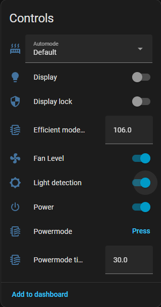
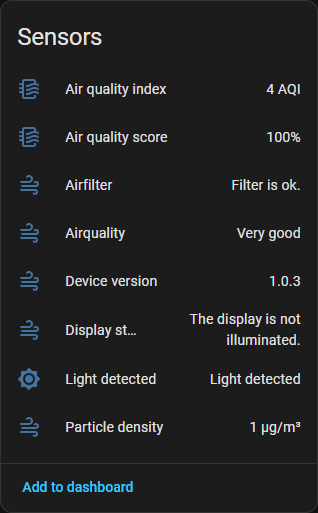

# Levoit Vital Esphome component

Esphome component for the Levoit Vital **200S**, **200S pro** and **100S**.

As there was no component or firmware or anything for the Levoit Vital 200S i reverse engineered most of the protocol and made a esphome componend to use.
- This should also work with the Levoit Vital 200S Pro, as (i asked the manufacturer) the pro version is the exact same device but in another color.
- If you want to go deeper, i provided my current reverse engineering data ([command table.xlsx](https://github.com/user-attachments/files/23830099/command.table.xlsx)).
- **Protocol Documentation**: See [PROTOCOL.md](PROTOCOL.md) for complete UART protocol specification, including message structure, command reference, status field mappings, and checksum calculation.

## Features

- **Fan Component** with speed levels (1-4) and preset modes:
  - **Manual**: Direct fan speed control
  - **Sleep**: Quiet operation mode
  - **Automatic**: AI-driven fan speed based on air quality
  - **Pet**: Optimized for pet environments
- **Sensors**: PM2.5 particle density, air quality score/index, filter status
  - **Light detected**: Binary sensor that reports ambient light detection (only works when the "Light detection" switch is enabled)
- **Controls**: Device power, display settings, light detection
- **Automation Modes**: Auto mode with Default/Quiet/Efficient presets

# How to?

## Disassemble:
1. To initially flash the Firmware or to make a backup, you must disassemble the device only slightly. It is enough to unscrew the 3 screws on the front of the device on its black top part. To view the screws, remove the white plastic screen in front of the HEPA filter.
2. After unscrewing, slightly pull the black top part towards you. First pull the left side up.
3. The Right side is then mostly stuck by a bracked (see Image below). you can losen it with a Long screwdriver, or if the gap is big enough with your finger.

4. Be cautious, as the cable that is connecting the Motor with the board is very short and can break the plastic connector (see Image below). Try to losen it first. If you reassemble the device later, just remove the cable from the cable Routing, this will give you enogh length to put the top plastic part in place again.

## Flashsing preperation:
Solder cables to all 6 contact Pins of the esp.

* connect IO to GND
* also connect GND to you USB Adapter's GND
* connect RX to your USB adapter's TX
* connect TX to your USB adapter's RX
* connect Vcc3,3V to your USB adapter's VCC
* also connect the Vcc3,3V to EN

* For flashing the device or dumping the firmware you can leave the IO connected to GND.
* Also, make sure that EN is connected to 3,3V
* Also make sure, that you USB Adapter is set to 3,3V, as some of them also have a 5V functionality or Jumper.

## Flashing/backup

- Best practice is if you first backup the Firmware of the device.
- You can Dump the flash with esptool (Windows and linuks works both).

To make a complete backup you can use this command:
 `esptool --port your_port_here read-flash 0 ALL filename.bin `
 
I Used an older USB to Serial Adapter and could not backup with full Speed. If oyu have the same Problems, and the backup process breaks often, try to reduce the Baudrate, this takes very Long but is reliable. I used 19200

 `esptool --port your_port_here --baud 19200 read-flash 0 ALL filename.bin `

 After Dumping you can upload the firmware. Currently i do not provide a binary file for you, but yout can build and upload the component with esphome. 
 - The only thing you must configure in the yaml file are the firts 3 ids (or maybe leave it the way they are) and your wifi/ap data.

## Screenshots

### Controls

### Sensors

